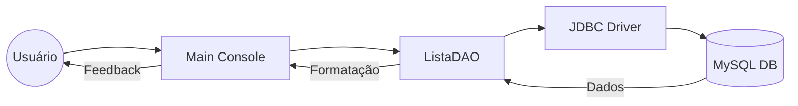

# To-Do List Manager (Java & MySQL)

[](https://www.oracle.com/java/)
[](https://www.mysql.com/)
[](https://maven.apache.org/)
[](https://opensource.org/licenses/MIT)

## Visão Geral

O **To-Do List Manager** é uma aplicação de console desenvolvida em Java para o gerenciamento eficiente de tarefas diárias. O projeto integra uma interface de linha de comando intuitiva com persistência de dados em um banco de dados MySQL, permitindo que o usuário adicione, visualize e controle o status de suas atividades de forma permanente.

## Funcionalidades Principais

*   **Adição de Tarefas:** Registro de novas atividades com descrição detalhada.
*   **Gestão de Status:** Alternância entre tarefas "Em andamento" e "Concluídas".
*   **Visualização Filtrada:** Listagem separada para tarefas pendentes e finalizadas, facilitando o foco no que ainda precisa ser feito.
*   **Persistência de Dados:** Armazenamento seguro em MySQL, garantindo que as informações não sejam perdidas ao fechar a aplicação.
*   **Interface de Console:** Menu interativo para navegação simplificada entre as opções do sistema.

## Arquitetura do Projeto

A aplicação segue o padrão **DAO (Data Access Object)**, garantindo uma separação clara entre a interface do usuário e a lógica de manipulação de dados.

### Estrutura de Classes

| Classe | Descrição |
| :--- | :--- |
| `Main.java` | Gerencia o loop principal da aplicação e a interação com o usuário via console. |
| `ListaDAO.java` | Contém toda a lógica de persistência (INSERT, SELECT, UPDATE) no banco de dados. |
| `Conexao.java` | Responsável por estabelecer e fornecer a conexão JDBC com o servidor MySQL. |

### Diagrama de Fluxo (Mermaid)



## Tecnologias Utilizadas

*   **Linguagem:** Java 17
*   **Banco de Dados:** MySQL 8.0
*   **Gerenciador de Build:** Maven
*   **Conectividade:** JDBC (MySQL Connector/J)

## Configuração e Instalação

### Pré-requisitos
*   Java Development Kit (JDK) 17 ou superior.
*   Apache Maven instalado.
*   Servidor MySQL em execução.

### Configuração do Banco de Dados

1.  Crie o banco de dados e a tabela necessária executando o seguinte script SQL:

```sql
CREATE DATABASE toDoList;

USE toDoList;

CREATE TABLE listas (
    id INT AUTO_INCREMENT PRIMARY KEY,
    descricao VARCHAR(1000) NOT NULL,
    status BOOLEAN DEFAULT FALSE
);
```

### Configuração da Aplicação

1.  Clone o repositório:
    ```bash
    git clone https://github.com/GilvanPedro/Lista_de_Afazeres.git
    cd Lista_de_Afazeres/ToDoList
    ```

2.  Configure suas credenciais do MySQL no arquivo `src/main/java/br/com/Conexao.java`:
    ```java
    String user = "seu_usuario";
    String password = "sua_senha";
    ```

3.  Compile e execute o projeto:
    ```bash
    mvn clean compile
    mvn exec:java -Dexec.mainClass="br.com.Main"
    ```

## Como Usar

Ao iniciar a aplicação, você verá o seguinte menu:
1.  **Adicionar Tarefa:** Digite a descrição da atividade.
2.  **Visualizar Tarefas:** Lista todas as tarefas com status "Em andamento".
3.  **Marcar Tarefa Como Concluída:** Informe o ID da tarefa para mudar seu status.
4.  **Ver Tarefas Concluídas:** Lista todas as atividades já finalizadas.
5.  **Sair:** Encerra a execução do programa.

## Licença

Distribuído sob a licença MIT. Veja `LICENSE` para mais informações.

---
Desenvolvido por [Gilvan Pedro](https://github.com/GilvanPedro)
